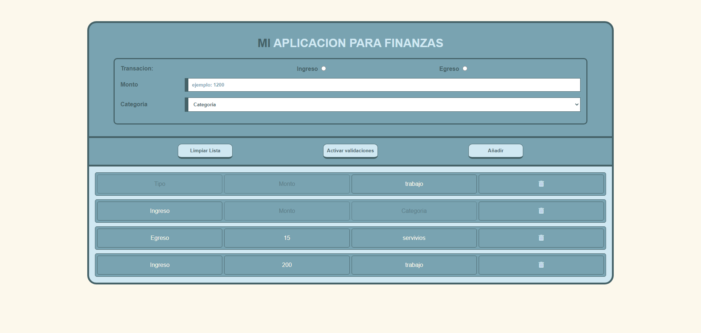
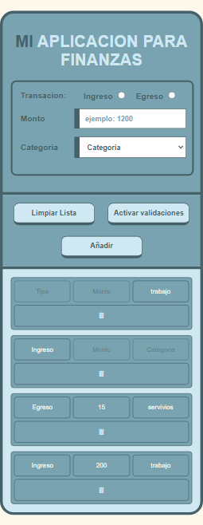

### sobre que trata

Es una app para registrar los ingresos y egresos que usa localStorage para almacenar la informacion. Empeze para practicar y mientras avanzaba me fui añadienco mas funciones y editando e eliminando. 

Con este pequeño projecto aprendi mucho, la mas importante diria que es tener una planificacion base previa, me paso que el codigo quedo muy dificil de leer y muy enredado, eso sucedio sobre todo por ir agregando ideas que no fueron pensadas desde el inicio lo que me obligo a editar lo previo para poder insertar lo nuevo. A lo ultimo ya era un choque de codigo nuevo y antiguo, lo que llevo a que no funcione como estaba previsto y eliminar mucho que implemente:

-editar la lista ya echa 
-añadir opciones de forma dinamica a categoria
-mas opciones para guardar en la lista

En un futuro, cuando tenga mas tiempo, planeo hacer uno nuevo pero implementando y evitando lo aprendido aqui.

### Capturas de la app

### Enlace a la app

- URL de la app: [click para ir al sitio web](https://sergio-ivan-melgarejo.github.io/MiApp-Practica-01/)
